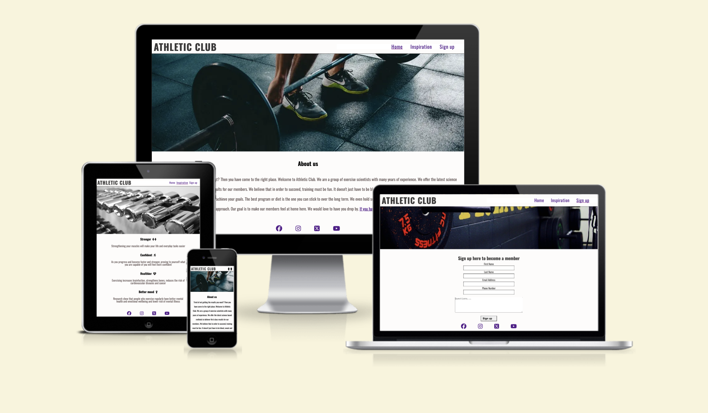

# Athletic Club

* Athletic Club is a gym site that provides membership and seminars. The site gives the user a brief explanation of who they are and what they offer. It aims to help potential members improve their physique and overall health.
* This site is for anyone who wants to improve their physique and overall health

### Navigation bar 

.png)

* The navigation is userfriendly and provides links to Home, Ispiration and Sign up pages.

* It will be responisve on all devices. 

* Clicking on the Home button will direct the user to the main page.

### Home page
.png)

* The home page give the user an understanding of what Athletic club offer and a sense of welcome which is the goal of the front page. A serious background combined with confidence-inspiring text.

### Footer
.png)

* The footer section includes links to social media sites that will open in an new tab.
* This will give the user an easy way of following Athletic Club on different social media platforms.
* The footer section is on all pages.

## Inspiration page
.png)

* This section provides the user with several health and psychological benefits on why they should consider to start exercising

## Sign up page
.png)

* In this section the user can fill out a form to become a member.
* The user can use the text area if they have any questions.
* "Questions and phone area" are the only ones that are not required.

## Existing Features

* Navbar
* Footer
* Social media icons
* Contact form

## Testing 

* The site is tested on Google chrome, Safari

### Navigation links

| Navigation link | Page to load | Expectation|
| --- | --- | --- |
| Home | index.html | Navigated correctly |
| Inspiration | member.html |Navigated correctly |
| Sign up | inspiration.html |Navigated correctly |

### Footer (Social media icons)

| Navigation link | Page to load | Expectation|
| --- | --- | --- |
| Link to Facebook | https://www.facebook.com/ | Navigated correctly (opens in a new tab) |
| Link to Instagram | https://www.instagram.com/ |Navigated correctly (opens in a new tab) |
| Link to Twitter | https://twitter.com/?lang=sv |Navigated correctly (opens in a new tab) |
| Link to Youtube | https://www.youtube.com/ |Navigated correctly (opens in a new tab) |

### Logo 

| Navigation link | Page to load | Expectation|
| --- | --- | --- |
| Logo | index.html | Pushing the logo the user is directed to the home page |

### Sign up form 

 Feature  | action | Expectation| Results|
| --- | --- | --- | --- |
|Name fields | Press the sign up button without typing any text| If the user does not type any text, an error message "Please, fill out this field" appears | An error message appears just as expected|
| Email field | Press the sign up button without typing any text | If the user does not type any text, an error message "Please, fill out this field" appears| An error message appears just as expected|
| Phone number field | Press the sign up button without typing any text |The user is directed to the contact page with a "Welcome" message | User is directed towards the contact page with a "Welcome" message|
| The text area | Press the sign up button without typing any text |The user is directed to the contact page with a "Welcome" message | User is directed towards the contact page with a "Welcome" message|

## Manual Testing

## Validator testing

### CSS

* 4 errors found and fixed using [Jigsaw Validator](https://jigsaw.w3.org/css-validator/)

### HTML

* Home page
  * 7 errors were found and fixed using [W3C VALIDATOR](https://validator.w3.org/)

* Inpiration page 
  * 12 errors were found and fixed using [W3C VALIDATOR](https://validator.w3.org/)

* Sign up page
  * 12 error were found and fixed using [W3C VALIDATOR](https://validator.w3.org/)

* Contact page
  * No errors were found using [W3C VALIDATOR](https://validator.w3.org/)

.png) 

## Lighthouse testing

### Home Page

.png)

### Inspiration page

.png)

### Sign up page

.png)

## Deployment

* This site was deployed to Github pages.
  * Go to the settings tab i Github repository
  * Select pages on the menu on the left side navigation bar 
  * In the Build and deployment section set the source to deploy from a branch and set the branch to main and root
  * Click save
  * Your site is now deployd to Github 
  * The live link can be found here https://patteerrik.github.io/Athletic-Club

## Credits

* [Favicon.io](https://favicon.io/) was used to create the favicon
* [Pexels](https://www.pexels.com/sv-se/sok/gym/) was used to download images for the site
* [I love img](https://www.iloveimg.com/resize-image) was used to resize the images
* [W3schools](https://www.w3schools.com/) whas used to create boxshadow on inspiration page
* "Love runnig" helped with getting the favicon in place
* [Brocode](https://www.youtube.com/watch?v=VQWu4e6agPc&list=WL&index=6&t=53s) used to create a dropdown menu
* [Fontawesome](https://fontawesome.com/) was used for all fonts
* [Am I responsive](https://ui.dev/amiresponsive) was used along with Google chrome devtools to see how the site look on various devices
* I used [W3schools](https://www.w3schools.com/), [She code](https://www.shecodes.io/), [Brocode](https://www.youtube.com/@BroCodez), [Geeks for geeks](https://www.geeksforgeeks.org/) and LMS for information on a large variety of problem solutions 
